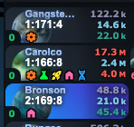

# OGLight - Build Queue Icons

Turns the tiny colored bars next to each planet (showing what's currently queued — building, research, ship, lifeform) into proper icons with hover tooltips, so you can tell at a glance what's building where.

## Install

Requires [Tampermonkey](https://www.tampermonkey.net/) and OGLight already installed — see the [main README](../../README.md) for setup. Then open [OGLight-BuildIcons.user.js](OGLight-BuildIcons.user.js), click **Raw**, and Tampermonkey will prompt you to install it.
