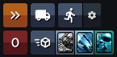

# OGLight - Fleet Shortcuts

Adds one-click buttons on the fleet-dispatch screen to send 100% of your metal, crystal, or deuterium instantly — no popup, no typing amounts.

## Install

Requires [Tampermonkey](https://www.tampermonkey.net/) and OGLight already installed — see the [main README](../../README.md) for setup.

**[Install from Greasy Fork](https://greasyfork.org/en/scripts/596556-oglight-fleet-shortcuts)** (recommended — keeps itself updated).

Or, to track the latest code straight from this repo: open [OGLight-FleetShortcuts.user.js](OGLight-FleetShortcuts.user.js), click **Raw**, and Tampermonkey will prompt you to install it.
