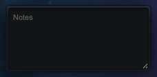

# OGLight - Notes Panel

Adds a simple persistent notes box below your planet list — jot down build orders, targets, or reminders. Auto-saves as you type, per universe.

## Install

Requires [Tampermonkey](https://www.tampermonkey.net/) and OGLight already installed — see the [main README](../../README.md) for setup.

**[Install from Greasy Fork](https://greasyfork.org/en/scripts/596557-oglight-notes-panel)** (recommended — keeps itself updated).

Or, to track the latest code straight from this repo: open [OGLight-Notes.user.js](OGLight-Notes.user.js), click **Raw**, and Tampermonkey will prompt you to install it.
