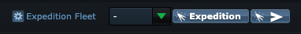

# OGLight - Quick Expedition

On the galaxy page's "Deep space" row, adds a one-click button right next to
the native **Expedition** button — selects your first saved expedition fleet
template and sends it straight away, no need to open the dropdown and click
send yourself.

## Install

Requires [Tampermonkey](https://www.tampermonkey.net/) and OGLight already installed — see the [main README](../../README.md) for setup.

Not yet published to Greasy Fork. To install: open [OGLight-QuickExpedition.user.js](OGLight-QuickExpedition.user.js), click **Raw**, and Tampermonkey will prompt you to install it.
