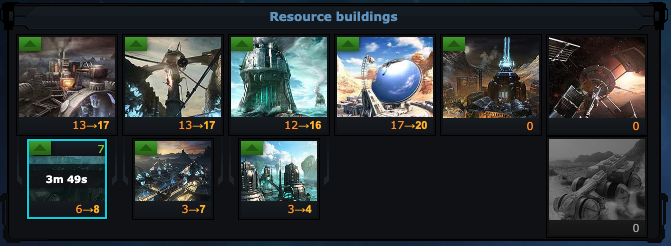

# OGLight - Todolist Target Levels

Shows the target level from your OGLight Todolist directly on the building/research tiles, right next to the current level, so you always know what you're working toward without opening the Todolist.

## Install

Requires [Tampermonkey](https://www.tampermonkey.net/) and OGLight already installed — see the [main README](../../README.md) for setup. Then open [OGLight-TodoLevels.user.js](OGLight-TodoLevels.user.js), click **Raw**, and Tampermonkey will prompt you to install it.
